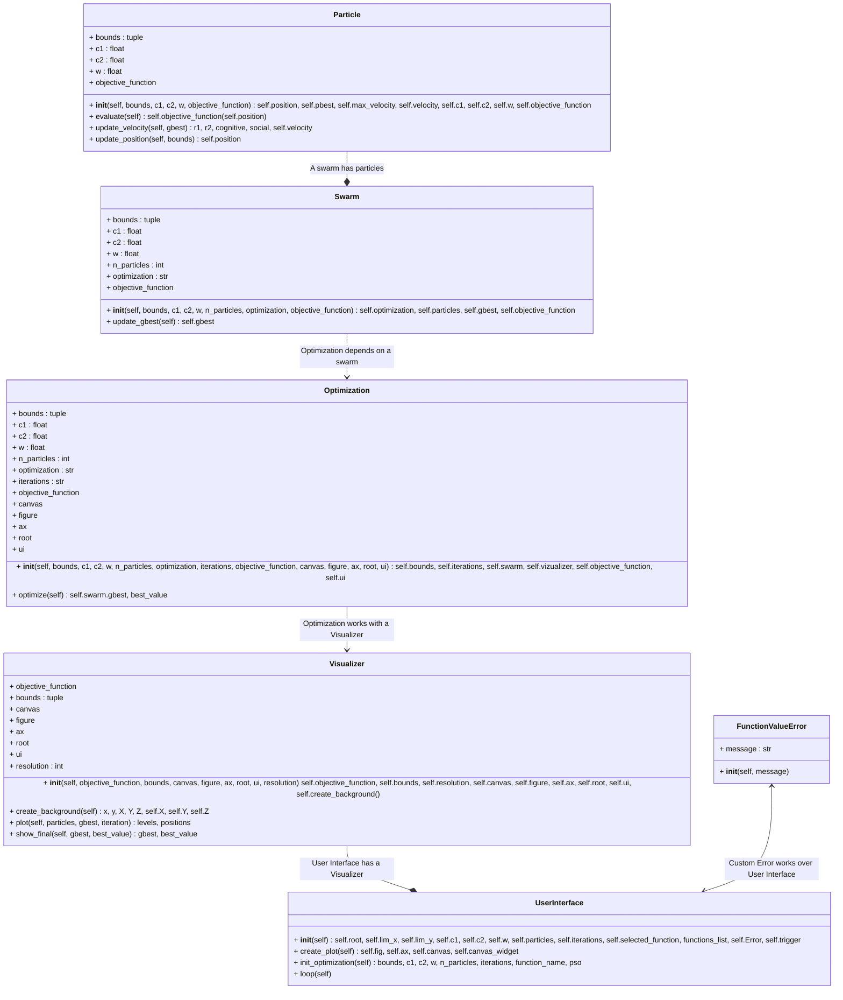

## PSO ALGORITHM IMPLEMENTATION

### Contributors: 
| Name | ID |
|---|---|
| Alejandro Bello | 1013037759 |
| Malcolm Carrillo | 1010962608 |
| Rafael Chirivi | 1034661580 |

<details><summary>Get ready to see the great logo: </summary><p>
<div align='center'>
<figure> </br>
<figcaption><b> "we're programmers, not designers" </b></figcaption></figure>
</div>
</p></details><br>

### Installation

To install and run this project, follow these steps:

1. **Clone the repository**  
   ```bash
   git clone https://github.com/abellol/pso_implementation.git
   cd pso_implementation/
   ```

2. **Create and activate a virtual environment (optional but recommended)**  
   - On Windows:  
     ```bash
     python -m venv my_venv
     venv\Scripts\activate
     ```
   - On macOS/Linux:  
     ```bash
     python -m venv my_venv
     source venv/bin/activate
     ```

3. **Install dependencies**  
   ```bash
   pip install -r requirements.txt
   ```

## Usage

Run the main script with:

```bash
python main.py
```


## Configuration

The file contains adjustable parameters such as:
- Number of particles
- Inertia weight
- Cognitive and social coefficients (listed as c1 and c2)
- Number of iterations
- Objective function (taken from some presets)

Modify these parameters to suit your optimization problem.


## Class diagram


